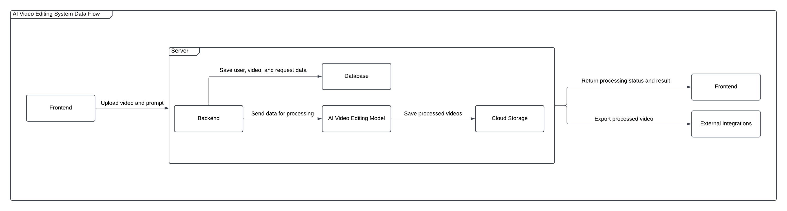
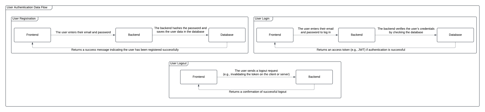

# Architecture Overview

## Introduction

This document provides a detailed overview of the system architecture for the AI-powered video editing project. The system automates video editing tasks based on user prompts, featuring an intuitive interface and leveraging AI models to handle complex operations seamlessly.

---

## High-Level Architecture

The architecture consists of several key components that work together to provide automatic video editing capabilities.

### Key Components:

1. **Frontend**  
   - Allows users to upload videos and provide text prompts for editing.  
   - Provides an intuitive and user-friendly interface.

2. **Backend**  
   - Handles business logic, processes user requests, and manages communication with other components.  
   - Coordinates the interactions between the frontend, AI model, database, and cloud storage.

3. **AI Video Editing Model**  
   - Processes video editing tasks based on user instructions (e.g., object removal, cutting fragments, adding effects).  
   - Utilizes machine learning algorithms to automate complex editing processes.

4. **Database**  
   - Stores user data, video metadata, and request history.  
   - Keeps track of processing status and user interactions.

5. **Cloud Storage**  
   - Stores uploaded videos and processed video files.  
   - Provides scalable and reliable storage (e.g., AWS S3 or Google Cloud Storage).

6. **External Integrations**  
   - Interfaces with third-party tools like Photoshop for advanced video editing capabilities.  
   - Allows users to export processed videos for additional editing.

---

## User Authentication Flow

The following diagram outlines the process for user registration, login, and logout.

### Steps:

1. **Registration**:  
   - The user enters their email and password in the frontend.  
   - The backend hashes the password and stores the user data in the database.  
   - The backend returns a success message to the frontend.

2. **Login**:  
   - The user enters their email and password in the frontend.  
   - The backend verifies the credentials by checking the database.  
   - If authentication is successful, the backend returns an access token (e.g., JWT) to the frontend.

3. **Authorization**:  
   - The frontend sends the access token to the backend with each request requiring authentication.  
   - The backend verifies the token and authorizes the request.

4. **Logout**:  
   - The user sends a logout request from the frontend.  
   - The backend confirms the logout, optionally invalidating the token.

---

## Data Flow Explanation

### 1. **Video Upload and Processing**

1. **Frontend**:  
   - The user uploads a video and provides a text prompt (e.g., "remove object from 5:00 to 5:15").

2. **Backend**:  
   - Receives the video and prompt.  
   - Stores the original video in cloud storage.  
   - Saves metadata and request information in the database.

3. **AI Video Editing Model**:  
   - The backend sends the video and prompt to the AI model for processing.  
   - The AI model performs the requested editing and saves the processed video in cloud storage.

4. **Backend**:  
   - Updates the database with the processing status.  
   - Returns the processed video link and status to the frontend.

5. **Frontend**:  
   - Displays the processed video to the user and provides an option to download it.

### 2. **External Integrations**

- After processing, the backend can send the video to external tools like Photoshop for advanced editing.  
- This allows users to refine the AI-edited video further.

---

## Database Schema

### **1. Users Table**

| Column          | Type           | Description                    |
|-----------------|----------------|--------------------------------|
| `user_id`       | INT (PK)       | Unique user identifier         |
| `email`         | VARCHAR(255)   | User's email (unique)          |
| `password_hash` | VARCHAR(255)   | Hashed user password           |
| `created_at`    | DATETIME       | Account creation timestamp     |

### **2. Videos Table**

| Column               | Type           | Description                           |
|-----------------------|----------------|---------------------------------------|
| `video_id`           | INT (PK)       | Unique video identifier               |
| `user_id`            | INT (FK)       | Reference to the user who uploaded it |
| `original_video_url` | VARCHAR(500)   | URL of the original uploaded video    |
| `processed_video_url`| VARCHAR(500)   | URL of the processed video            |
| `upload_date`        | DATETIME       | Video upload timestamp                |
| `status`             | VARCHAR(50)    | Processing status (e.g., "completed") |

### **3. Requests Table**

| Column         | Type           | Description                              |
|----------------|----------------|------------------------------------------|
| `request_id`   | INT (PK)       | Unique request identifier                |
| `video_id`     | INT (FK)       | Reference to the related video           |
| `prompt`       | TEXT           | User's text prompt for video editing     |
| `created_at`   | DATETIME       | Request creation timestamp               |
| `completed_at` | DATETIME       | Request completion timestamp             |

### **4. ProcessingLogs Table**

| Column         | Type           | Description                              |
|----------------|----------------|------------------------------------------|
| `log_id`       | INT (PK)       | Unique log entry identifier              |
| `request_id`   | INT (FK)       | Reference to the related request         |
| `log_message`  | TEXT           | Log message describing the process       |
| `timestamp`    | DATETIME       | Log entry timestamp                      |

---

## Conclusion

This architecture overview provides a comprehensive understanding of the AI-powered video editing system, covering user authentication, data flow, key components, and database structure. The system is designed to be scalable, user-friendly, and efficient in automating video editing tasks.

